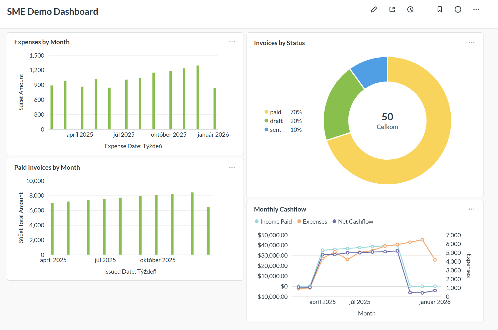
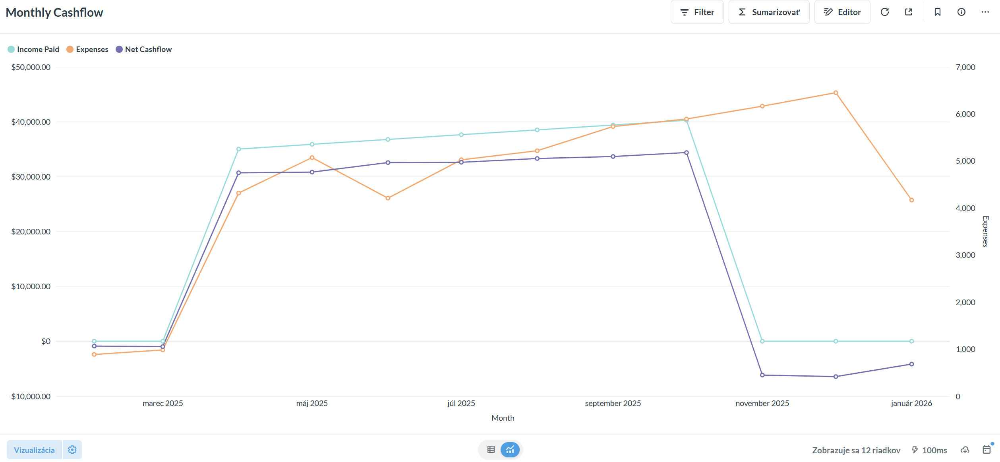
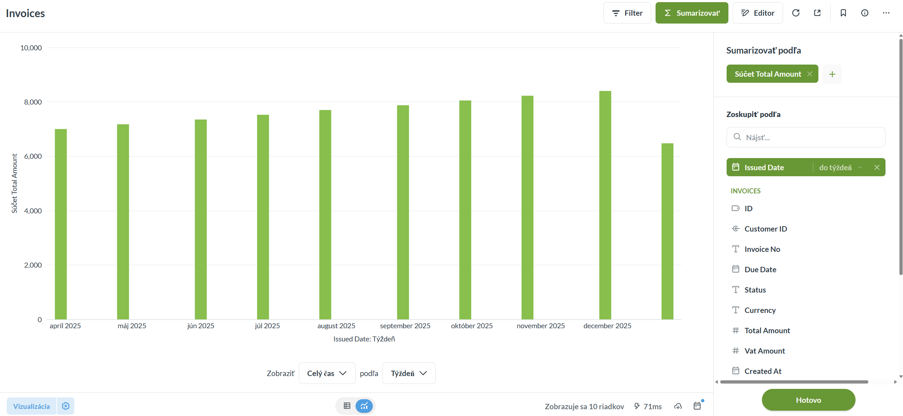

# 📈 Metabase SME Setup (practical starter)

Tento repozitár je praktický „starter“ pre nasadenie Metabase v malej alebo strednej firme.
Cieľ: rýchlo získať prehľadné dashboardy nad dátami bez zbytočnej zložitosti.

Nie je to hotový produkt ani univerzálny návod. Je to základ, z ktorého sa dá rozumne vychádzať.

---

## 👥 Pre koho je to určené

- malé a stredné firmy (SME), ktoré chcú mať prehľad nad dátami
- interný IT človek, externý dodávateľ alebo technicky zdatný človek vo firme
- firmy s dátami v účtovnom systéme / ERP / interných aplikáciách


## 📚 Čo tu nájdeš

- Metabase spustený cez Docker Compose
- PostgreSQL ako interná databáza Metabase (Metabase metadata)
- voliteľný „demo“ PostgreSQL server na testovanie pripojenia a ukážkové dáta


## 🧩 Požiadavky

- Docker + Docker Compose
- porty:
  - 3000 (Metabase)


## 🚀 Rýchly štart

1. Naklonuj repozitár:
   ```bash
   git clone <URL_TO_YOUR_REPO>
   cd metabase-sme-setup
   ```
2. Skopíruj a uprav environment premenné:
    ```bash
    cp .env.example .env
    ```
3. Spusť stack:
  ```bash
  docker compose up -d
  ```
4. Otvor Metabase v prehliadači:
http://localhost:3000.

5. Dokonči úvodný setup v Metabase (admin účet, základné nastavenia).


## 🔗 Pripojenie na zdroj dát

V Metabase choď do:
Admin settings → Databases → Add database

pripoj svoje reálne databázy (ERP/účto/IS)

ak chceš otestovať, môžeš sa pripojiť na demo_data_db (viď nižšie)

## 🧪 Demo DB (voliteľné)
> AK demo DB nechceš používať zakomentuj alebo odstráň: demo_data_db v docker-compose.yml

Tento projekt obsahuje voliteľnú demo databázu (demo_data_db), ktorá slúži na rýchle vyskúšanie Metabase bez potreby pripájať reálne firemné dáta.

Demo databáza je postavená na PostgreSQL a pri prvom spustení sa automaticky naplní ukážkovými dátami pomocou SQL seed skriptu.

**Čo demo dáta obsahujú**

Po inicializácii databázy sú dostupné tieto objekty:

**Tabuľky**

customers – ukážkoví zákazníci (SME typológia)

invoices – vydané faktúry s rôznymi stavmi (draft, sent, paid)

expenses – náklady podľa kategórií

**View**

kpi_monthly_cashflow – mesačný cashflow (príjmy, náklady, netto)

Tieto dáta sú navrhnuté tak, aby bolo možné:

- okamžite vytvárať dashboardy
- testovať KPI pre malé a stredné firmy
- demonštrovať prácu s dátami bez citlivých informácií

**Pripojenie databázy**
Pripojenie v Metabase (Admin → Databases → Add database):
Typ databázy: PostgreSQL
Zobraziť meno: Demo DB
Hostiteľ: demo_data_db
port: 5432
Meno databázy: demo
Používateľské meno: demo
Heslo: z .env

Ulož databázu a počkaj na inicializáciu schémy
Po dokončení sa demo dáta zobrazia v:
Browse data


**Poznámka**

Demo databáza je určená len na testovanie a ukážky.
V reálnom nasadení:
pripoj vlastné ERP / účtovné / prevádzkové databázy

Metabase do databáz nikdy nezapisuje, používa ich výhradne na čítanie a analýzu.

## 🛡️ Bezpečnostné minimum (odporúčané)

NIKDY nezverejňuj Metabase do internetu bez HTTPS a autentifikácie

používaj role a prístupy (skupiny, permissions)

oddel účty pre čítanie dát (read-only) od účtov s právami na zmenu

používaj silné heslá a unikátne tajomstvá v .env (necommitovať)

produkčne rieš zálohy (aspoň metabase_db) a aktualizácie


## ⛔ Čo to NIE je

nie je to kompletné BI riešenie

nie je to referenčná architektúra pre enterprise

neobsahuje reálne integračné konektory na účtovné/ERP systémy (tie sú vždy špecifické)

## 🧭 Roadmap / nápady na pokračovanie

konkrétny príklad: napojenie dát z účtovného systému POHODA

príklady dashboardov (cashflow, náklady vs. výnosy, KPI)

hardening, prístupy a bezpečnostné pravidlá pre produkciu

## ⚖️ Disclaimer

Používaj na vlastnú zodpovednosť. Každá firma má iné dáta, procesy a bezpečnostné požiadavky.

## Demo DB screenshot



